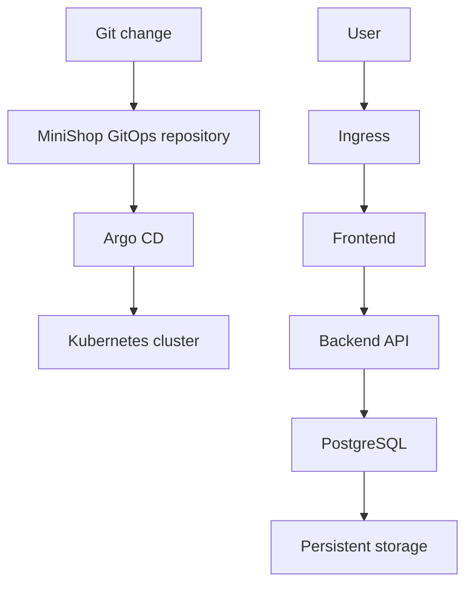

# MiniShop GitOps

[](https://argo-cd.readthedocs.io/)
[](https://kubernetes.io/)


The GitOps source of truth for deploying MiniShop to Kubernetes through Argo CD.

This repository stores the desired Kubernetes state for the MiniShop frontend, backend, PostgreSQL database, ingress, RBAC, network controls, and persistent storage.

## GitOps architecture



Argo CD continuously compares the desired state stored in this repository with the resources running in the Kubernetes cluster.

When a difference is detected, Argo CD reports the application as out of sync and reconciles the cluster according to the configured synchronization policy.

## Repository model

MiniShop is separated into three repositories:

| Repository | Responsibility |
| --- | --- |
| [`minishop-app`](https://github.com/TechWorld707/minishop-app) | Stores the application source code, container definitions, vulnerability scanning, and Amazon ECR publishing workflow |
| [`minishop-gitops`](https://github.com/TechWorld707/minishop-gitops) | Stores the desired Kubernetes application state reconciled by Argo CD |
| [`minishop-infrastructure`](https://github.com/TechWorld707/minishop-infrastructure) | Documents the AWS EC2 kubeadm cluster infrastructure and rebuild process |

## Repository structure

```text
.
├── apps/
│   └── minishop/
│       ├── backend/          # Backend workload and service configuration
│       ├── frontend/         # Frontend workload and service configuration
│       ├── ingress/          # External application routing
│       ├── networkpolicy/    # Workload communication restrictions
│       ├── postgres/         # PostgreSQL workload configuration
│       ├── rbac/             # Kubernetes access-control resources
│       └── storage/          # Persistent storage configuration
├── argocd/
│   └── minishop-application.yaml
└── README.md
```

## Resource ownership

This repository manages the desired state for:

- Frontend workload
- Backend API workload
- PostgreSQL database
- Kubernetes Services
- Ingress routing
- Role-based access control
- NetworkPolicies
- Persistent storage
- Application replica configuration
- Container image references

Application source code and container build definitions are intentionally maintained in the separate application repository.

## Argo CD application

The Argo CD Application resource is defined in:

```text
argocd/minishop-application.yaml
```

Apply the Argo CD Application manifest:

```bash
kubectl apply -f argocd/minishop-application.yaml
```

Confirm that the Application resource exists:

```bash
kubectl get applications -n argocd
```

Inspect the MiniShop Application:

```bash
kubectl describe application minishop -n argocd
```

The exact Application name and namespace should match the values defined in `minishop-application.yaml`.

## Deployment workflow

The intended delivery flow is:

1. Application code is changed in `minishop-app`.
2. GitHub Actions builds the container images.
3. Trivy scans the images for known vulnerabilities.
4. Approved images are pushed to Amazon ECR.
5. The required image tag or digest is updated in this repository.
6. The GitOps change is reviewed and committed.
7. Argo CD detects the new desired state.
8. Argo CD synchronizes the Kubernetes resources.
9. Kubernetes performs the application rollout.

This separation ensures that building an image does not automatically bypass review of the deployment state.

## Image updates

Container image references should identify the exact application version being deployed.

Git commit SHAs or immutable image digests provide stronger traceability than mutable tags such as `latest`.

An image update should be committed with a clear message, for example:

```text
deploy: update MiniShop images to application commit SHA
```

The commit history then provides a record of which application version was requested for deployment.

## Deployment validation

Confirm that Argo CD reports the application as synchronized and healthy:

```bash
kubectl get applications -n argocd
```

Check the MiniShop workloads:

```bash
kubectl get deployments
kubectl get pods
kubectl get services
kubectl get ingress
```

Check the PostgreSQL workload and storage:

```bash
kubectl get statefulsets
kubectl get persistentvolumes
kubectl get persistentvolumeclaims
```

Check the security resources:

```bash
kubectl get serviceaccounts
kubectl get roles
kubectl get rolebindings
kubectl get networkpolicies
```

## Application health

Check the frontend and backend rollout status using the names defined in the manifests:

```bash
kubectl rollout status deployment/FRONTEND_DEPLOYMENT_NAME
kubectl rollout status deployment/BACKEND_DEPLOYMENT_NAME
```

Inspect logs if a workload is unhealthy:

```bash
kubectl logs deployment/FRONTEND_DEPLOYMENT_NAME
kubectl logs deployment/BACKEND_DEPLOYMENT_NAME
```

Replace the placeholders with the actual deployment names under `apps/minishop`.

## Network controls

NetworkPolicies are stored under:

```text
apps/minishop/networkpolicy
```

These policies define permitted communication between application components.

When reviewing a policy, verify:

- The selected source pods
- The selected destination pods
- Allowed ports
- Required ingress traffic
- Required egress traffic
- DNS access where needed

Test application connectivity after every NetworkPolicy change.

## Role-based access control

RBAC configuration is stored under:

```text
apps/minishop/rbac
```

RBAC resources should grant only the permissions required by each workload or operator.

Review:

```bash
kubectl get serviceaccounts
kubectl get roles
kubectl get rolebindings
```

Inspect a specific authorization decision with:

```bash
kubectl auth can-i VERB RESOURCE \
  --as=system:serviceaccount:NAMESPACE:SERVICE_ACCOUNT
```

Replace the placeholders with the values being tested.

## Persistent storage

Storage configuration is maintained under:

```text
apps/minishop/storage
```

PostgreSQL uses persistent storage so that application data is not tied to the lifecycle of an individual pod.

Check storage status:

```bash
kubectl get pv
kubectl get pvc
```

Before changing or deleting storage resources, review the storage class and reclaim policy to avoid unintended data loss.

## Rollback

Rollback is performed through Git.

1. Identify the last known-good deployment commit.
2. Revert the change that introduced the failed state.
3. Push the revert commit.
4. Allow Argo CD to reconcile the cluster.
5. Verify application health and synchronization status.

Example:

```bash
git log --oneline
git revert COMMIT_SHA
git push
```

This approach preserves an auditable record of both the deployment and rollback.

## Operational principles

This repository follows these GitOps principles:

- Git is the source of truth.
- Deployment changes are version controlled.
- Argo CD reconciles declared state.
- Application and deployment responsibilities remain separate.
- Image versions are traceable to application changes.
- Rollbacks are performed through reviewed Git history.
- Direct manual cluster changes are avoided where possible.

Manual changes made with `kubectl edit` may be reverted by Argo CD if they are not represented in Git.

## Security considerations

The Kubernetes configuration demonstrates:

- Role-based access control
- NetworkPolicies
- Persistent storage configuration
- Separate application components
- Health-aware Kubernetes workloads
- Git-reviewed deployment changes
- Argo CD reconciliation
- Traceable container image references

Secrets must not be committed directly to this repository. Sensitive values should be supplied through an approved secret-management process.

## Related repositories

- [MiniShop application](https://github.com/TechWorld707/minishop-app)
- [MiniShop infrastructure](https://github.com/TechWorld707/minishop-infrastructure)

## Project scope

This repository demonstrates GitOps-based application delivery to a self-managed Kubernetes cluster on AWS EC2.

It uses production-oriented practices but should be reviewed and adapted before handling real customer, payment, or production data.

## Author

**Henry — TechWorld707**

DevOps and Platform Engineer focused on AWS, Kubernetes, Terraform, Docker, Ansible, CI/CD, and GitOps.

- [GitHub profile](https://github.com/TechWorld707)
- [Email](mailto:hento77@yahoo.com)
